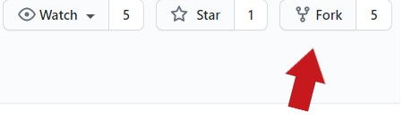

If you want to change the workspace repository, it might be useful to choose a forked repository as workspace to test your tutorial. 

Before cloning the repository we have to fork it first.

Go to the workspace repository on GitHub. In our tutorial it would be:

https://github.com/devonfw-tutorials/workspace-devon4ng.git

Fork the repository by clicking on the &#39;Fork&#39; button.
This will create a copy of the repository in your own GitHub account. You will find it in &#39;Your repositories&#39;.

Now you can run your tutorial and add your username and the right branch to the command.

If you run 

&#39;bash localBuildRun.sh --user [YOUR_NAME] --branch [YOUR_BRANCH]&#39;

in the terminal, it will clone 

https://github.com/[YOUR_NAME]/workspace-devon4ng.git

into the workspace directory and checkout to the branch [YOUR_BRANCH]

A quick summary: 

1. You need to fork the original workspace-repository

2. With the flag &#39;--user&#39; you can specify the GitHub user

3. With the flad &#39;--branch&#39; you can specify the branch
