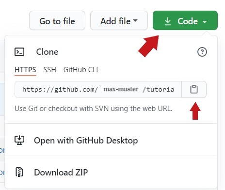

It might also come in handy to use a local repository instead of the original or forked repository. 
Choosing a local repository instead of a GitHub repository is a feature only used inside the console runner. 
You should have
https://github.com/devonfw-tutorials/workspace-devon4ng.git
forked and listed in &#39;Your repositories&#39;.

Open the forked repository in your GitHub account and copy the repository URL as shown in image below.

Paste the URL to the &#39;git clone&#39; command to clone the repostitory. For this tutorial we will use the original tutorials repository of the &#39;devonfw-tutorials&#39; GitHub account.

When you run the command on your machine, you will of course need to customize the URL and add your personal GitHub name. So the command will be `git clone https://github.com/YourName/workspace-devon4ng.git`.

The console runner will always search for local folder first, before cloning a repository. If it doesn&#39;t find a folder named &#39;workspace-devon4ng&#39; next to the folders &#39;tutorials&#39; and &#39;tutorial-compiler&#39;, it will clone depending on the given arguments the original or the forked repository instead. 

A quick summary: 

1) You need to fork the original workspace directory 

2) clone the repository next to the &#39;tutorials&#39; and the &#39;tutorial-compiler&#39; folder 

